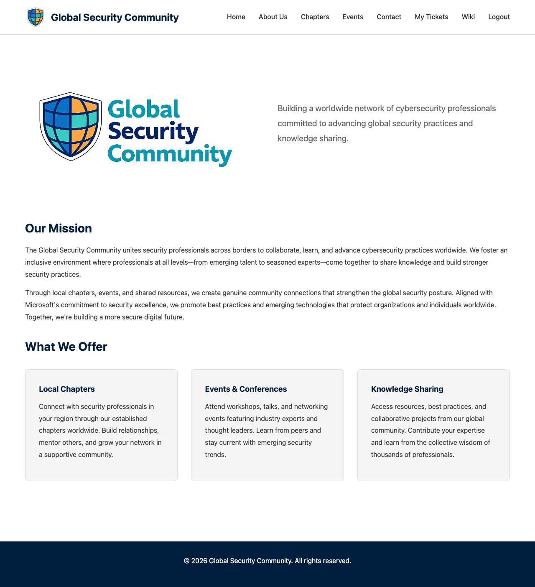
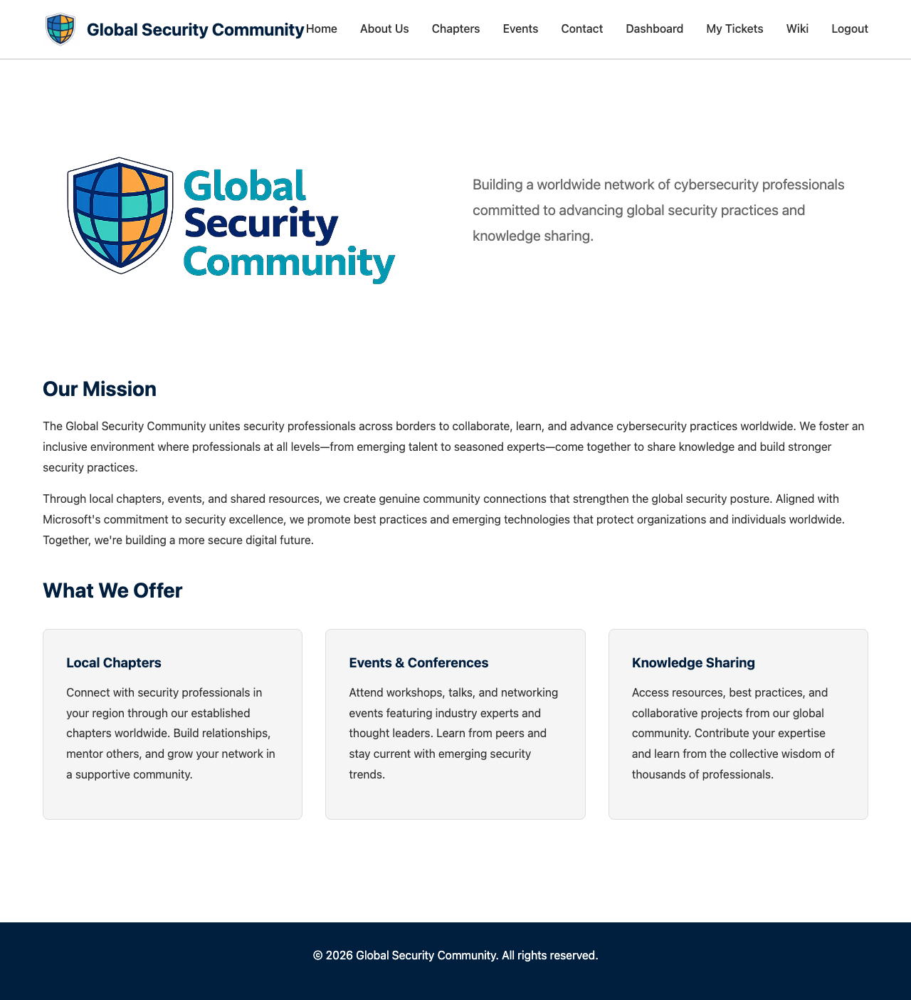

# Authentication & Accounts

GSC uses Microsoft Entra External ID (CIAM) for user authentication, providing a secure and familiar sign-up/sign-in experience.

## Navigation

Before logging in, the navigation bar shows a **Login** link:

After logging in, authenticated users see additional links — My Tickets, Wiki, and Logout:

Admin users (chapter leads) also see a **Dashboard** link:

## Creating an Account

1. Click **Login** in the navigation bar
2. On the sign-in page, click **"No account? Create one"**
3. Enter your email address
4. Complete the profile information (name, job title, location, etc.)
5. Verify your email with the one-time code sent to your inbox
6. You're now logged in and can register for events

## Signing In

1. Click **Login** in the navigation bar
2. Enter your email and password
3. You'll be redirected back to the website

## User Roles

| Role | Access | How to Get It |
|------|--------|---------------|
| **Anonymous** | Browse events, chapters, and public pages | No login required |
| **Authenticated** | Register for events, view tickets, download badges | Create an account |
| **Volunteer** | Check-in scanner access for assigned events | Added by a chapter lead via the Dashboard |
| **Admin** | Create events, manage attendance, scan tickets, issue badges, manage volunteers | Become an approved chapter lead |

!!! note
    The admin role is automatically assigned when your email matches an approved chapter lead in the system. No manual role assignment is needed.

## Protected Pages

| Page | Required Role |
|------|--------------|
| /register/ | Authenticated |
| /my-tickets/ | Authenticated |
| /scanner/ | Admin or Volunteer |
| /dashboard/ | Admin |

Attempting to access a protected page without the required role will redirect you to the login page.

## PWA / Offline Access

The GSC website works as a Progressive Web App (PWA). You can add it to your phone's home screen for:

- Quick access without opening a browser
- Offline access to event pages and your tickets
- Full-screen experience (no browser chrome)

To install: visit the website in your mobile browser and use "Add to Home Screen" from the browser menu.

## Related Pages

- [Registration](registration.md) — Register for events
- [My Tickets](my-tickets.md) — View your tickets
- [Chapter Lead Application](chapter-application.md) — Apply to become a chapter lead
