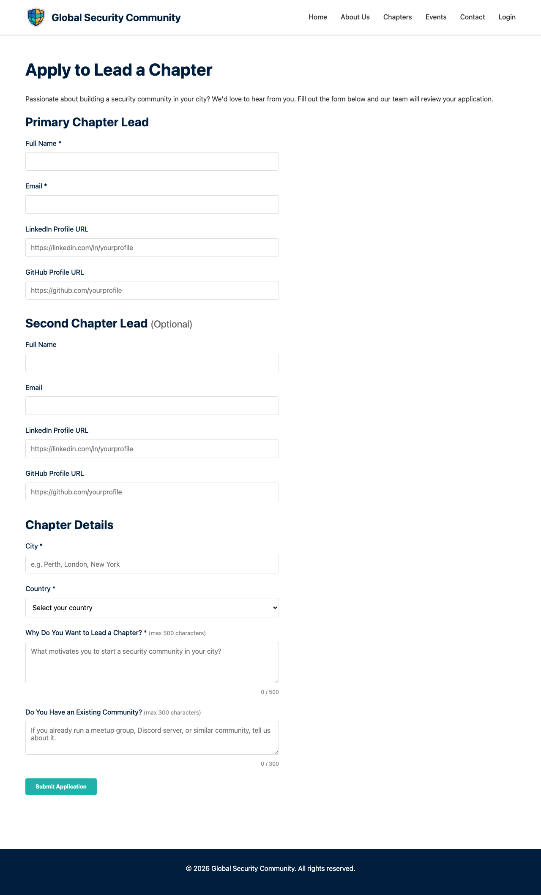

# Chapter Lead Application

The Chapter Lead Application page allows community members to apply to start a GSC chapter in their city.

## URL

`/chapters/apply/`

## Application Form

Applicants provide the following information:

| Field | Required | Purpose |
|-------|----------|---------|
| Full Name | Yes | Identification |
| Email | Yes | Communication and Gravatar avatar |
| LinkedIn Profile | No | Social link on chapter page |
| GitHub Profile | No | Social link on chapter page |
| City | Yes | Chapter location |
| Country | Yes | Chapter location |
| Why do you want to lead a chapter? | Yes | Motivation assessment |
| Existing Community | No | Background information |
| Co-lead Name | No | Optional second chapter lead |
| Co-lead Email | No | Optional second chapter lead |
| Co-lead LinkedIn | No | Social link on chapter page |
| Co-lead GitHub | No | Social link on chapter page |

## Application Process

1. **Submit** — Applicant fills in the form and submits
2. **Notification** — The application is stored in the database and a notification is posted to the GSC Discord server
3. **Review** — GSC administrators receive the application with approve/reject links
4. **Approval** — If approved:
    - A chapter page is automatically generated at `/chapters/{city-slug}/`
    - A Discord channel is created for the chapter
    - The chapter lead's email is registered for the admin role
    - The chapter appears on the Chapters listing page
5. **Rejection** — If rejected, a notification is sent to Discord

## Chapter Page

Approved chapters get a dedicated page featuring:

- Chapter city and country
- Chapter lead name(s) with Gravatar profile images (see [Setting Up Your Profile Photo](chapters.md#setting-up-your-profile-photo-gravatar))
- Social links (GitHub, LinkedIn) if provided
- Upcoming events for the chapter
- Link to the chapter's Discord channel

## Anti-Spam Protection

The application form includes a honeypot field to prevent automated spam submissions. Submissions that fill in the hidden field are silently rejected.

## Related Pages

- [Chapters](chapters.md) — Browse existing chapters
- [Dashboard](dashboard.md) — Chapter lead management tools
