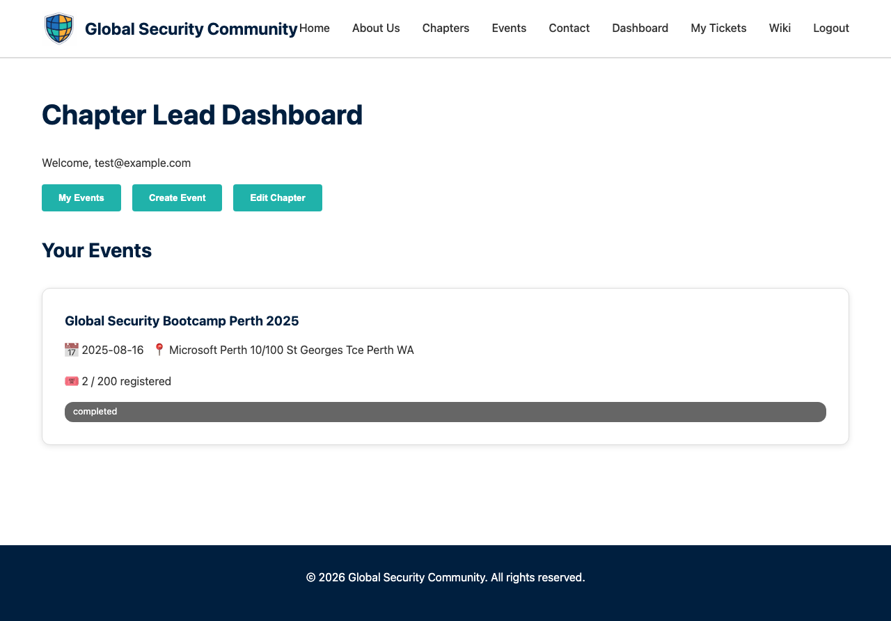

# Chapter Lead Dashboard

The Dashboard is the management hub for chapter leads to create and manage events.

## URL

`/dashboard/`

## Access

Requires the **admin** role. Only approved chapter leads are automatically assigned this role. Other users will receive a 403 Forbidden response.

!!! info "How admin role works"
    When a user logs in, the system checks if their email matches an approved chapter lead in the database. If it does, they are automatically assigned the admin role.

## Features

### Event Management

- **Create Event** — Form to create a new bootcamp event with:

    

    - Event title
    - Start and end dates
    - Location
    - Description
    - Registration capacity (0 = unlimited)
    - Sessionize API ID (optional, for agenda/speaker integration)
    - Chapter association

- **Event List** — View all events you've created with current registration counts

- **Event Status** — Update event status (open, closed, completed)

### Volunteers / Committee

- **Volunteer Interest** — Attendees who expressed volunteer interest during registration are shown with a 🙋 icon in the attendance list, making it easy to identify potential volunteers
- **Add Volunteers** — Assign volunteers or committee members to an event by entering their name and email
- **Volunteer Access** — Volunteers get access to the QR check-in scanner for the event without full admin privileges
- **Remove Volunteers** — Remove volunteer access at any time from the event detail view

!!! note
    Volunteers must have a GSC account (signed up via the website). When they log in, the system automatically detects their email and grants them the volunteer role.

### Attendance

- **Attendance Dashboard** — Real-time view of check-ins for an event:
    - Total registered vs checked-in count
    - Individual attendee check-in status
- **CSV Export** — Download a CSV of all registrations for reporting
- **Scanner Link** — Quick link to the QR scanner page for event-day check-in

### Badges

- **Issue Badges** — After an event, generate and email digital badges to:
    - Attendees (who checked in)
    - Speakers
    - Organisers / Volunteers

## Event Creation Flow

1. Fill in the event details on the dashboard
2. Click "Create Event"
3. The system:
    - Stores the event in the database
    - Triggers a GitHub Action to generate a dedicated event page
    - Posts a notification to the chapter's Discord channel
4. The event appears on the website within a few minutes

## Related Pages

- [Events](events.md) — Public event listings
- [Scanner](scanner.md) — QR code check-in tool
- [Badges](badges.md) — Digital badge system
- [Chapter Lead Application](chapter-application.md) — How to become a chapter lead

### Chapter Editing

Chapter leads can update their chapter information directly from the Dashboard:

The chapter edit form allows you to update:

- **Chapter leads** — Up to 4 leads with name and LinkedIn profile
- **Social links** — GitHub, LinkedIn, Twitter/X, and website URLs

Changes are saved immediately and reflected on the chapter's public page.
