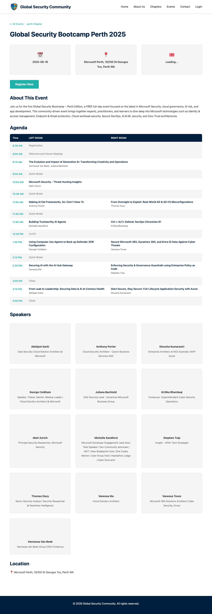

# Events

The Events page lists all upcoming and past bootcamp events hosted by GSC chapters worldwide.

## URL

`/events/`

## Features

- **Event listing** — Automatically displays all published events with title, date, location, and chapter
- **Status indicators** — Events show whether registration is open, closed, or the event is completed
- **Direct links** — Each event card links to its dedicated event page with full details

## How Events Are Created

Events are created by chapter leads (admin users) through the [Dashboard](dashboard.md). When a new event is created:

1. The chapter lead fills in the event details (title, date, location, capacity, Sessionize API ID)
2. The system stores the event in Azure Table Storage
3. A GitHub Action automatically generates a dedicated event page
4. The event appears in the events listing

## Event Detail Pages

Each event has its own page at `/events/{slug}/` which includes:

- **Event information** — Title, date range, location, description
- **Registration count** — Live count of registered attendees vs capacity
- **Register button** — Links to the registration page (requires login)
- **Sessionize integration** — If a Sessionize API ID is configured, the page automatically fetches and displays:
    - Session agenda / schedule
    - Speaker profiles and bios

## Related Pages

- [Registration](registration.md) — How attendees register for events
- [Dashboard](dashboard.md) — How chapter leads manage events
- [Scanner](scanner.md) — QR code check-in on event day
